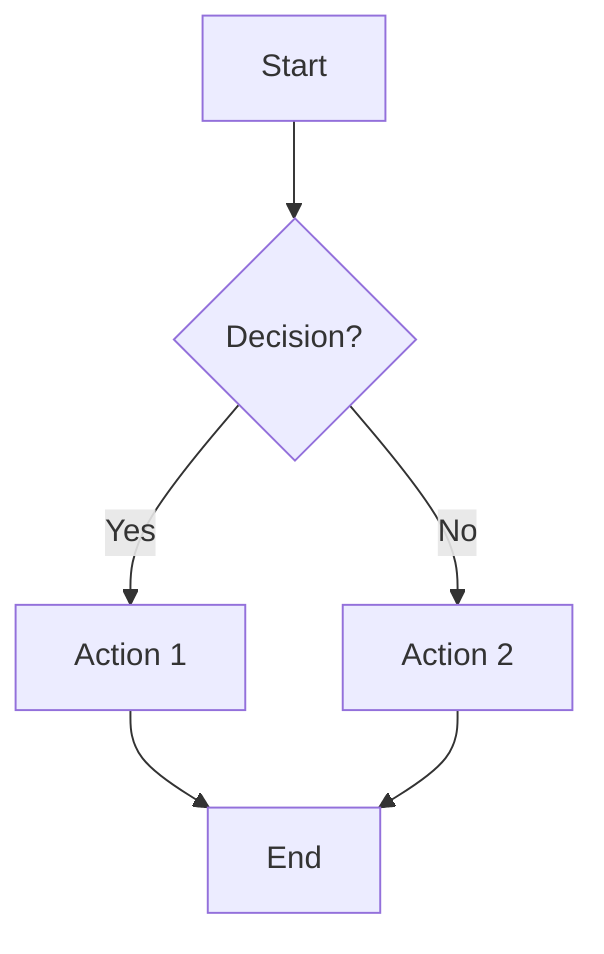
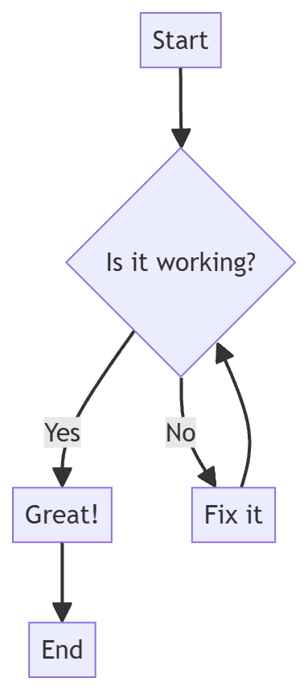

# 🧜‍♀️ Mermaid Diagram Renderer

A beautiful, interactive web-based Mermaid diagram editor with stunning gradient animations and modern UI design.

   

## ✨ Features

### 🎨 **Stunning Visual Design**
- **Animated Gradient Background** - Smooth color transitions across 6 beautiful colors
- **Gradient Button Effects** - Color-coded buttons with elegant hover animations
- **Glass Morphism UI** - Semi-transparent panels with backdrop blur effects
- **Gradient Border Separators** - Beautiful animated borders between editor panels

### 🚀 **Powerful Functionality**
- **Live Preview** - Real-time diagram rendering as you type
- **Multiple Themes** - Default, Dark, Forest, Neutral, and Base themes
- **Flexible Layouts** - Support for all Mermaid diagram directions
- **Interactive Controls** - Zoom, pan, and navigate your diagrams with ease
- **Floating Control Panels** - Elegant overlay controls for seamless interaction

### 🎯 **Smart Interactions**
- **Drag-to-Pan** - Intuitive mouse and touch gesture support
- **Keyboard Shortcuts** - Arrow keys for panning, Ctrl+Enter to render
- **Auto-formatting** - Built-in code formatter for clean Mermaid syntax
- **Quick Examples** - One-click templates for all diagram types

### 🎮 **Floating Control System**
- **Bottom-Left Zoom Controls** - Elegant + and - buttons for precise zoom control
- **Bottom-Right Directional Pad** - Arrow keys layout (↑ ← ↓ →) for intuitive navigation
- **Top-Right Reset Control** - Single reset button for returning to default view
- **Glass Morphism Design** - Semi-transparent panels with backdrop blur effects
- **Smart Positioning** - Controls stay visible without blocking diagram content
- **Gradient Button Styling** - Color-coded controls matching the app's design theme

### 🤖 **AI-Powered Editor**
- **Smart Error Detection** - Automatic identification of Mermaid syntax errors
- **AI-Powered Fixes** - OpenRouter integration with free Llama 4 Maverick model
- **Context-Aware Suggestions** - AI understands your diagram intent and provides relevant fixes
- **One-Click Corrections** - Apply AI-suggested fixes with a single button click
- **Free AI Model** - Uses meta-llama/llama-4-maverick:free for cost-effective error correction

### 📱 **Modern UX**
- **Responsive Design** - Works perfectly on desktop and mobile
- **Smooth Animations** - Carefully tuned transition speeds for optimal feel
- **Enhanced Dropdowns** - Gradient-bordered theme and direction selectors
- **Download Options** - Export as SVG or high-quality PNG

## 🎪 **Supported Diagram Types**

| Type | Description | Example Use |
|------|-------------|-------------|
| 🔄 **Flowchart** | Process flows and decision trees | Business processes, algorithms |
| 📞 **Sequence** | Interaction timelines | API calls, user workflows |
| 📊 **Gantt** | Project timelines | Project management, scheduling |
| 🥧 **Pie Chart** | Data visualization | Statistics, proportions |
| 🏗️ **Class** | Object relationships | Software architecture |
| 🔀 **State** | State machines | System behaviors |
| 🗃️ **ER Diagram** | Database relationships | Data modeling |
| 🗺️ **User Journey** | Experience mapping | UX design, customer flows |

## 🚀 **Quick Start**

1. **Open** `mermaid-parser.html` in your browser
2. **Write** your Mermaid code in the left editor
3. **Watch** the live preview update automatically
4. **Navigate** using floating controls (zoom with +/- buttons, pan with arrow pad)
5. **Use AI Fix** - Click "Fix with AI" if you encounter syntax errors
6. **Customize** with themes and directions
7. **Download** your diagram as SVG or PNG

### 🤖 **Using the AI Editor**

To use the AI-powered error correction:
1. **Add your OpenRouter API key** in the settings (top of the page)
2. **Write Mermaid code** - errors will be detected automatically
3. **Click "Fix with AI"** when syntax errors appear
4. **Review and apply** the AI-suggested corrections
5. **Enjoy error-free diagrams** with intelligent assistance!

> 💡 **Free AI Model**: Uses the free `meta-llama/llama-4-maverick-17b-128e-instruct:free` model, so you can fix errors without any cost!
> ⚠️ **Usage Limit**: Free tier users are limited to 50 AI model requests per day.
> 🔧 **No Test Button**: The AI functionality is tested directly when fixing actual syntax errors - no separate test button needed!

### 📝 **Example Code**

### 📸 **Screenshot**

*Example of a rendered Mermaid diagram in the viewer*

## 🎨 **Design Highlights**

### **Color Palette**
- 🌸 **Pink** `#e73c7e` - Primary accent
- 🌊 **Teal** `#23d5ab` - Secondary accent  
- 🌙 **Dark Blue** `#2c3e50` - Professional depth
- 🔥 **Orange** `#f39c12` - Action buttons
- 💜 **Purple** `#9b59b6` - Interactive elements
- 🧡 **Dark Orange** `#e67e22` - Hover states

### **Animation Timing**
- **Background Gradient**: 8s infinite cycle
- **Button Transitions**: 0.4s (0.6s for teal-blue gradients)
- **Border Glow**: 4s alternating pulse
- **Dropdown Effects**: 0.3s smooth transitions

## 🛠️ **Technical Features**

- **Pure HTML/CSS/JS** - No build process required
- **Mermaid.js v10.6.1** - Latest diagram rendering engine
- **OpenRouter API Integration** - Free Llama 4 Maverick model for AI-powered error correction
- **Floating Control Overlays** - CSS-based glass morphism floating panels
- **CSS Grid & Flexbox** - Modern responsive layouts
- **CSS Gradient Borders** - Advanced styling techniques
- **Touch Gesture Support** - Mobile-optimized interactions

## 📱 **Browser Support**

Works on all modern browsers that support:
- CSS Grid and Flexbox
- CSS Gradient Borders
- ES6+ JavaScript features
- Touch Events (mobile)

## 🎯 **Perfect For**

- 📋 **Documentation** - Technical specs and workflows
- 🎓 **Education** - Teaching concepts visually
- 💼 **Business** - Process mapping and planning
- 👨‍💻 **Development** - Architecture diagrams
- 🎨 **Design** - User experience flows

## 🌟 **Why Choose This Renderer?**

Unlike basic Mermaid editors, this renderer offers:
- **🎨 Beautiful Design** - Not just functional, but visually stunning
- **⚡ Smooth Performance** - Optimized animations and interactions
- **📱 Mobile Ready** - Touch-friendly interface
- **🎯 User Focused** - Intuitive controls and helpful features
- **🔧 No Setup** - Just open and start creating

## 🗺️ **Roadmap**

### ✅ **Recently Added**
- **🤖 AI Editor** - OpenRouter integration with free Llama 4 Maverick model for intelligent error correction
- **🎮 Floating Control System** - Elegant overlay zoom and directional controls with glass morphism design

### 🔮 **Upcoming Features**
Planned improvements for future releases:

- **🔷 Add Shapes** - Enhanced shape library for more diagram variety
- **📦 Add Subgraph** - Support for nested diagram structures
- **🎯 Add Icon** - Icon integration for richer visual elements
- **📝 Text Box** - Standalone text elements for annotations
- **🎨 Design and Rearrange** - Advanced layout and design tools
- **↩️ Redo and Undo Button** - Full edit history management

---

**Ready to create beautiful diagrams?** Open `mermaid-parser.html` and start designing! 🚀

*Made with ❤️ for the developer community*
